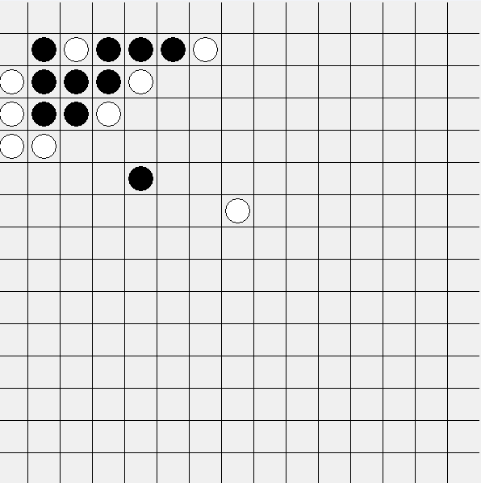
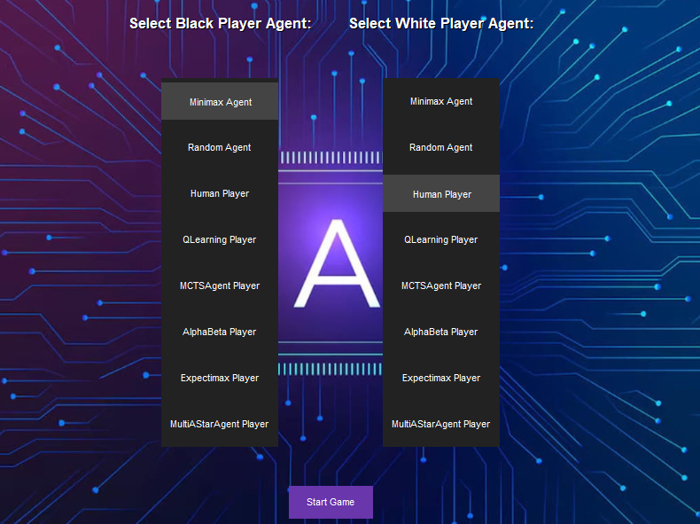

# Gomoku AI Agent

## Project Overview

This project implements several AI agents to play the board game Gomoku, including:

- Q-Learning
- Monte Carlo Tree Search (MCTS)
- Minimax with Alpha-Beta Pruning
- Expectimax

A hybrid multi-heuristic approach is also employed to optimize the search space for moves.

## Installation

**Python Version:** Ensure you're using Python 3.8.10.

**Install Dependencies:**

```bash
pip install -r requirements.txt
```

# Running the Project
To run the game with the GUI, use the following command:

```bash
python Gomoku.py
```

# Configurations
All game configurations, such as board size, number of games, and agent selection, are handled through the GUI. You can choose the agents to compete and customize their settings within the graphical interface.

# Agents
- Q-Learning
- Monte Carlo Tree Search (MCTS)
- Minimax with Alpha-Beta Pruning
- Expectimax
Game Analysis
Each run of the Gomoku game is logged, and data is saved for post-game analysis. To analyze the data and generate graphs, use the plot_creator.py script.

To create analysis graphs, run the following command:
```bash
python plot_creator.py
```

This will generate various graphical analyses such as win rates, missed opportunities, blocks, and other performance metrics for the AI agents.




